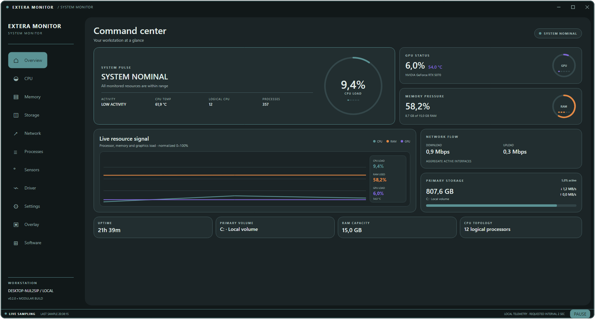
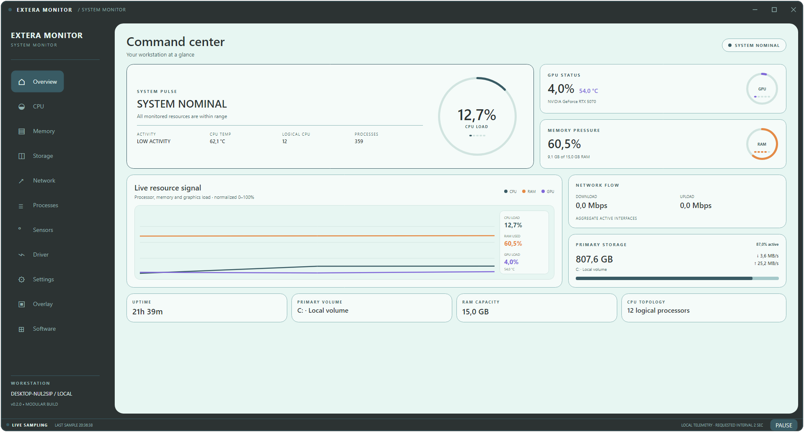
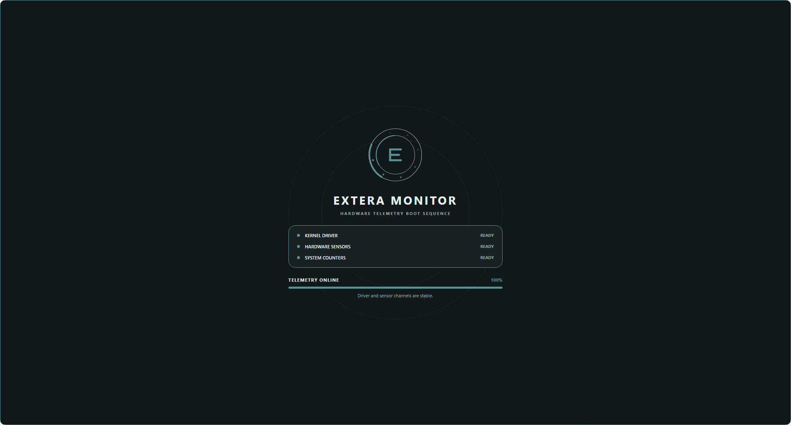

<p align="center">
  
</p>

# 🖥️ Extera Monitor — Driver-Aware Windows Telemetry

An animated Windows system monitor that combines native OS counters, hardware sensor APIs, and a custom kernel telemetry channel in one polished Avalonia desktop interface.

Built with **C# / .NET 10**, **Avalonia UI**, **LibreHardwareMonitor**, **WMI**, **SQLite**, and the bundled `ExteraMonitorDriver` source.

> *"System telemetry should be accurate enough to trust and clear enough to understand at a glance."*

---

## Command Center

The overview keeps the important signals visible without turning the desktop into a wall of numbers. CPU load and temperature share one system-pulse card, GPU data comes from the hardware stack with an NVIDIA driver fallback, and disk activity is kept separate from occupied capacity.



<details>
<summary><b>Light theme</b></summary>



</details>

---

## Driver-Verified Startup

The application does not reveal the dashboard after an arbitrary delay. Its animated boot sequence waits for two consecutive complete samples and verifies:

- the `ExteraMonitorDriver` telemetry channel;
- CPU temperature plus GPU load and temperature sensors;
- CPU core, memory, storage, and process counters.



If a source is still initializing, the boot screen stays visible and reports the exact stage instead of presenting empty dashboard values.

---

## Highlights

- **Live CPU telemetry** — total and per-core load, package temperature, effective clocks, power, voltage, limits, and frequency distribution
- **GPU monitoring** — load and temperature through LibreHardwareMonitor with `nvidia-smi` fallback
- **Honest storage metrics** — capacity usage, active time, and current read/write throughput are displayed as separate measurements
- **Two complete themes** — a calm original light palette and a purpose-built dark palette
- **Animated interface** — direction-aware vertical navigation, responsive card hover states, and an animated code-native Extera mark
- **Modular CPU workspace** — draggable, resizable, styled telemetry cards with persisted layouts
- **Local history** — lightweight SQLite persistence for samples, themes, accents, and widget configuration
- **Desktop overlay** — compact always-on-top telemetry for use outside the main window
- **Built-in visual capture mode** — deterministic UI screenshots for design verification

---

## Telemetry Architecture

```text
┌─────────────────────────────────────────────────────────────┐
│                    Avalonia Presentation                    │
│  Command Center · CPU Workspace · Sensors · Overlay · Theme │
└───────────────────────────┬─────────────────────────────────┘
                            │ SystemSnapshot
┌───────────────────────────┴─────────────────────────────────┐
│                   Metrics Aggregation                       │
│  CPU cores · RAM · disks · network · processes · uptime     │
└───────────────┬───────────────────┬─────────────────────────┘
                │                   │
┌───────────────┴────────────┐  ┌───┴─────────────────────────┐
│ Windows Native Sources     │  │ Hardware Sources            │
│ NT counters · WMI · IP     │  │ Extera driver · LHM · NVAPI │
└────────────────────────────┘  └─────────────────────────────┘
                │                   │
                └──────────┬────────┘
                           ▼
                 SQLite history and settings
```

---

## Project Structure

```text
AvaloniaPanel/
├── Driver/                 # ExteraMonitorDriver C source and local runtime bundle
├── Models/                 # Immutable snapshots and saved configuration models
├── Services/               # Native counters, sensors, driver loader, SQLite history
├── ViewModels/             # Dashboard state and module logic
├── Views/
│   ├── Controls/           # Gauges, graphs, color picker, animated Extera logo
│   └── Modules/            # Overview, CPU, memory, storage, network, sensors…
├── App.axaml               # Semantic light/dark palette and shared motion styles
└── ExteraMonitor.csproj
```

---

## Download

Each release contains two Windows x64 packages:

- **Installer** — installs into Program Files and creates Start menu and optional desktop shortcuts.
- **Portable ZIP** — extract the complete folder anywhere and run `ExteraMonitor.exe`; no installation or separate .NET runtime is required.

The installer adds Extera Monitor to the Windows Start menu and enables a desktop shortcut by default. While running, closing the main window keeps monitoring active in the system tray; use the tray menu to reopen the dashboard, pause/resume sampling, or exit completely.

Both variants request administrator access when launched because the hardware telemetry driver must be loaded.

## Supported systems

| Component | Current support |
|---|---|
| Operating system | Windows 11 x64; Windows 10 x64 builds capable of running .NET 10, with LTSC/Enterprise being the currently supported Microsoft configurations |
| CPU architecture | x64 only |
| Full kernel CPU telemetry | AMD Family 19h processors (Zen 3 / Zen 4) |
| Extended SMU power, voltage and clock telemetry | AMD Raphael, Family 19h Model 61h; verified on Ryzen 5 7500F |
| GPU telemetry | NVIDIA and AMD GPUs exposed through LibreHardwareMonitor; NVIDIA also has an `nvidia-smi` fallback |
| Windows 7 / 8.1 | Not supported by .NET 10 |
| ARM64 / x86 | No release package or compatible bundled driver yet |

The interface and standard Windows counters can support more hardware, but this release intentionally waits for its driver and required CPU/GPU sensor channels during startup. Systems outside the full-kernel matrix are therefore not claimed as fully supported yet.

## Build and Run

### Requirements

- Windows 10 or Windows 11
- [.NET 10 SDK](https://dotnet.microsoft.com/download/dotnet/10.0)
- Administrator access when loading the kernel driver
- A compatible `ExteraMonitorDriver.sys` runtime build for driver telemetry

```powershell
git clone https://github.com/DeFexNN/extera_system_monitor.git
cd extera_system_monitor
dotnet restore
dotnet run
```

The UI and standard Windows/LibreHardwareMonitor sources build without checked-in driver binaries. For the complete driver path, place the locally built `ExteraMonitorDriver.sys` and its loader runtime in `Driver/`; the project copies available runtime files into the output directory automatically.

### Release packages

```powershell
.\Packaging\Build-Release.ps1 -Version 0.2.1
```

The packaging script creates a compact installer, a self-contained portable ZIP, and a SHA-256 checksum file in `artifacts/`. If .NET 10 is not already installed, the installer shows download progress while fetching its runtime from Microsoft, then displays the runtime installer. Inno Setup 6 is required when building locally.

Every push and pull request also runs the [**Build Windows installer** workflow](https://github.com/DeFexNN/extera_system_monitor/actions/workflows/build-installer.yml). Download its installer, portable ZIP, and checksums from the workflow run's **Artifacts** section. Each push to `master` also updates the [latest master prerelease](https://github.com/DeFexNN/extera_system_monitor/releases/tag/latest-master). The installer is compact and downloads the Microsoft .NET 10 runtime during setup only when it is missing, with visible progress; an internet connection is needed in that case. The portable ZIP stays self-contained and works offline. Both packages include `kvc.exe`, `kvc.dat`, and `ExteraMonitorDriver.sys` together in the `Driver/` folder so the loader can access them.

On Windows, enable local automatic builds for each commit and merge with `git config core.hooksPath .githooks`. The hooks run the same release script and place the installer, portable ZIP, and checksums in `artifacts/`.

---

## Visual Verification

The application includes a RenderTargetBitmap capture path used to verify the real running Avalonia UI:

```powershell
ExteraMonitor.exe --capture overview.png --capture-section Overview --capture-dark
ExteraMonitor.exe --capture startup.png --capture-section Overview --capture-dark --capture-loading
```

The startup capture waits for verified telemetry, while the regular capture waits until the boot overlay has completed.

---

## Technology

| Layer | Technology |
|---|---|
| Desktop UI | Avalonia 12, XAML, custom-drawn controls |
| Runtime | .NET 10 / C# |
| CPU and GPU sensors | ExteraMonitorDriver, LibreHardwareMonitor, NVIDIA SMI |
| Windows telemetry | NT system calls, WMI performance classes, .NET diagnostics |
| Persistence | Microsoft.Data.Sqlite |
| Motion | Avalonia page transitions, brush/transform transitions, 60 FPS logo control |
| Packaging | Self-contained win-x64 publish, Inno Setup installer, portable ZIP |

---

## Scope

Extera Monitor is a Windows systems-programming and telemetry project. The driver source and low-level monitoring code are intended for development, hardware research, and controlled lab environments.

---

*"See the signal. Trust the source."*
creds to: https://github.com/wesmar/kvc
